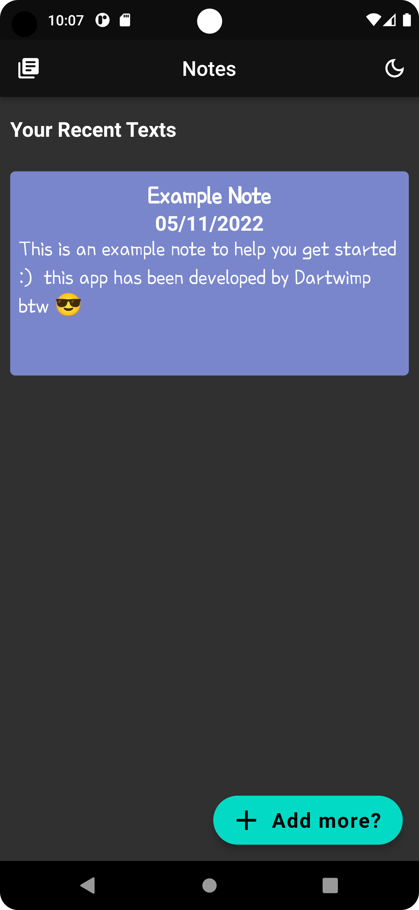
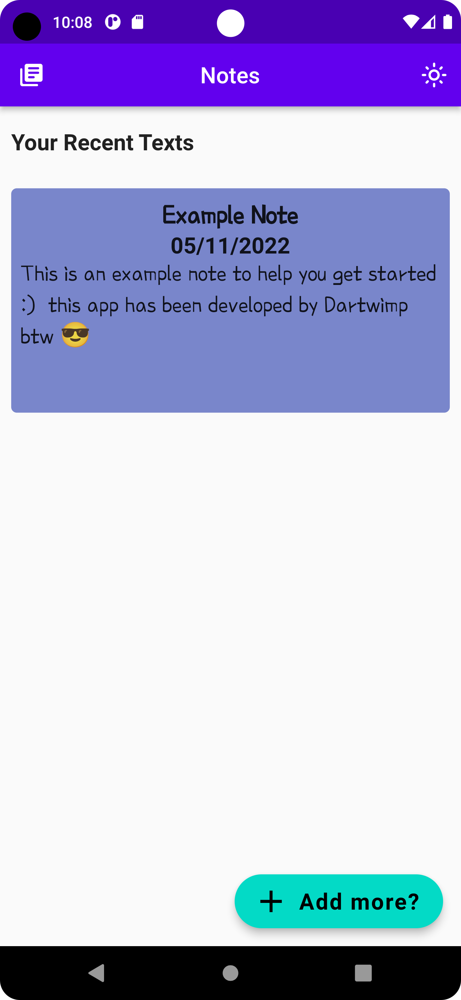

# notes_app

A simple app to perform all the CRUD operations (still in beta phase). The app has two UIs i.e. light and dark.

## How to run the app

<li>Donwload the app on your phone by <a href ="https://github.com/Darthwimp/notes_app/releases/download/beta/notes_app.apk">clicking on this link</a></li>
<li>install the app on your phone</li>

## How to use the app

<li>Using the app us quite simple. You just need to click the "add more?" floating button to add more notes. To access an existing note, simply tap on the note card.</li>
<li>You can toggle between the light mode and dark mode by tapping on the top right icon button</li>

## Preview of the app

